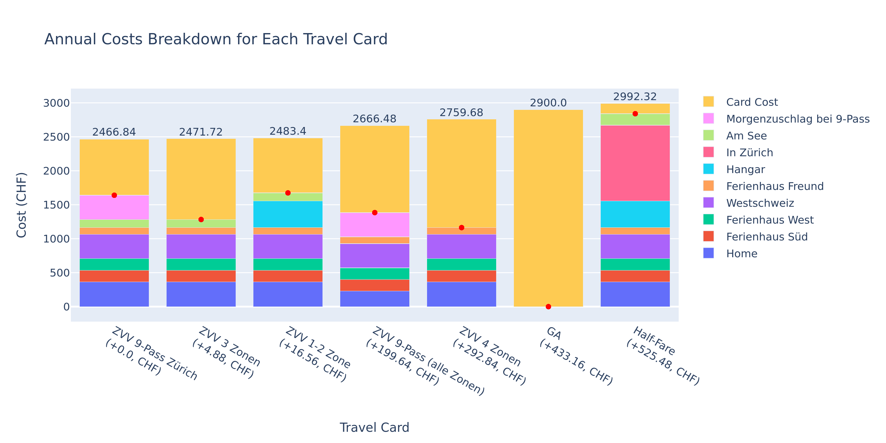

# Travel Card Cost Analysis

This repository contains a Jupyter notebook `calculate_travel_cards.ipynb` which analyzes and visualizes the costs of different travel cards based on certain routes and their frequencies. The analysis takes into consideration the cost of the card, the cost per route, and how often a route is travelled in a month.

## Prerequisites

Before you begin, ensure you have met the following requirements:

* You have installed the latest version of Python and Jupyter Notebook.
* You have a basic understanding of Python programming and data analysis concepts.
* You have installed the following Python libraries: pandas, numpy, matplotlib, and plotly.

## Running the Jupyter Notebook

To run `calculate_travel_cards.ipynb`, follow these steps:

1. Clone this repository.
2. Navigate to the cloned project directory.
3. Run the command `jupyter notebook` in your terminal.
4. Open `calculate_travel_cards.ipynb` in the Jupyter Notebook interface that appears in your web browser.
5. Execute the notebook cells in order.

## Data

The notebook leverages two CSV files: `Travel_Cards.csv` and `Travel_routes.csv`.

* `Travel_Cards.csv`: This file outlines various travel card options, along with their associated costs. Please customize this file to represent the options available in your local area.

* `Travel_routes.csv`: This file provides details about different travel routes, including their destinations, the associated costs with each travel card, and the frequency of travel per month. It's essential to tailor this file to align with your personal travel habits. 

  * Consider adding expensive trips even if they occur only once a year, as they could potentially influence the overall cost calculation. However, for minor trips that won't significantly impact the cost, you can choose to omit them.
  
  * To fetch the latest prices, visit [SBB](https://beta.sbb.ch), adjust according to your travel cards, and select the furthest stop included within your travel card zone (for instance, choose 'Winterthur' if you have an 'ZVV all zones' card and you're traveling to 'St. Gallen').

This process may be time-consuming, but it's a crucial step to ensure an accurate calculation of your travel costs.

## Methodology

The Jupyter notebook performs the following steps:

* Data is loaded from the CSV files.
* The cost data, which is stored as a string in the original CSV, is converted to a dictionary.
* The monthly costs for each travel card are calculated.
* The cumulative costs are calculated and plotted over the year for each travel card.
* The costs for each route are calculated and plotted for each travel card.

## Results

The notebook generates a stacked bar chart showing the annual cost breakdown for each travel card, which is saved as `annual_costs_breakdown.png`. This chart illustrates which travel card offers the best value depending on travel routes and their frequency.

## Contributing to Travel Card Cost Analysis

To contribute to Travel Card Cost Analysis, follow these steps:

1. Fork this repository.
2. Create a branch: `git checkout -b <branch_name>`.
3. Make your changes and commit them: `git commit -m '<commit_message>'`
4. Push to the original branch: `git push origin <project_name>/<location>`
5. Create the pull request.

## License

This project uses the following license: **MIT**.
